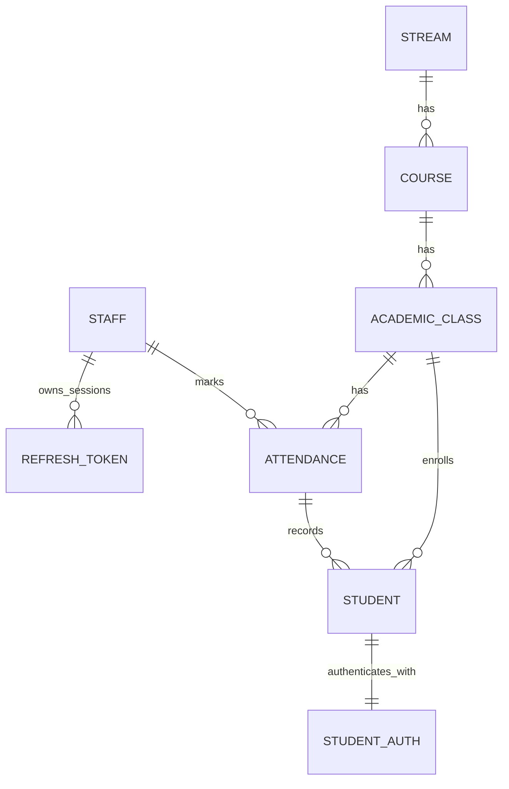

# 🗄️ Loyola ERP – Database Models

This directory contains all **MongoDB (Mongoose)** models used in the Loyola ERP system.  
The schemas are written in **TypeScript**, designed for **data integrity**, **performance**, and **clean separation of concerns**.

---

## 🏗️ Architecture Overview

The database is organized into three main domains:

1. **Academic Structure** – Stream → Course → Class
2. **User Management & Authentication** – Staff, Student, Tokens
3. **Operations** – Attendance

---

## 🔗 Entity Relationship Diagram



---

## 🏫 1. Academic Hierarchy

### Stream (`stream.model.ts`)

Top-level academic category.

- Examples: Arts, Science, Commerce
- Constraint: `name` must be unique

### Course (`course.model.ts`)

Represents a degree program.

- Relation: `streamId` → Stream
- Indexed by `name + streamId`

### Class (`class.model.ts`)

Represents a physical batch.

- Relation: `courseId` → Course
- Unique constraint:

```ts
{ courseId: 1, year: 1, section: 1 }
```

---

## 👥 2. User Profiles

### Staff (`staff.model.ts`)

Faculty and admin users.

- Roles: `PRINCIPAL`, `STAFF`
- No password stored here

### Student (`student.model.ts`)

Academic student profile.

- Linked to Stream, Course, Class
- Indexed by `classId`, `email`, `contact`

---

## 🔐 3. Authentication & Security

### RefreshToken (`refreshToken.model.ts`)

Staff session management.

- SHA-256 hashed tokens
- Device-bound sessions
- Supports revocation

### StudentAuth (`studentAuth.model.ts`)

Student credentials.

- Bcrypt password hash
- First-login password enforcement
- Login audit (`lastLogin`)

---

## 📝 4. Attendance (`attendance.model.ts`)

One document = one class, one date, one hour.

```ts
{
  class: ObjectId,
  staffId: ObjectId,
  date: Date,
  hour: number,
  records: [
    { student: ObjectId, status: "P" | "A" }
  ]
}
```

Unique index:

```ts
{ class: 1, date: 1, hour: 1 }
```

---

## 🚀 Usage Notes

Always import models in Next.js API routes to ensure registration.

```ts
import "@/models/student.model";
```

Models use hot-reload-safe registration to avoid overwrite errors.

---

**Maintained by**  
**Joe Rakesh – JWS Technologies**
